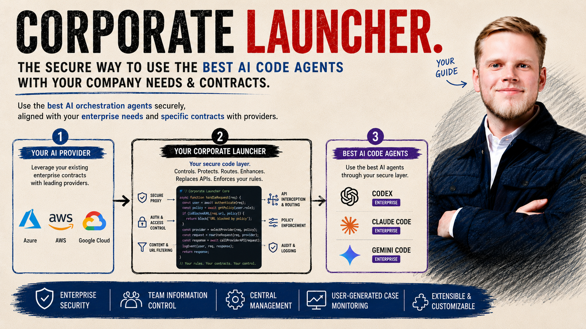

<div align="center">



# Corporate AI Launcher

### Create your personalized Corporate AI coding Launcher

**Build the bridge between your company's internal AI gateway and the public AI coding agents your developers want to use (Claude Code, Codex, Gemini, Cursor, Cline, Aider, opencode, Continue.dev).**

*One structured interview → a branded, audit-grade, legally-compliant launcher that routes every prompt through **your** enterprise AI infrastructure, hides the underlying vendor, applies your cyber rules + dev rules, tracks cost, and ships to your team.*

*You already have an enterprise AI (Bedrock, Azure OpenAI, Vertex, LiteLLM, internal gateway). Your developers already want Claude Code / Codex / Gemini. This skill is the missing wrapper — generated, not hand-coded.*

[Who is this for](#who-is-this-for) · [Goals](#goals) · [Core features](#core-features) · [Install](#install) · [How it works](#how-it-works) · [Cost tracking](#cost-tracking) · [Distribution](#distribution) · [FAQ](#faq) · [A word from the creator](#a-word-from-the-creator)

     

</div>

---

## The problem this solves

Your company has invested in an **internal AI infrastructure** — a corporate gateway in front of AWS Bedrock, Azure OpenAI, Vertex AI, or LiteLLM. Routed through the corporate VPN, behind SSO, logged for compliance, with the contracted models and the negotiated prices.

Your developers want **AI coding agents** — Claude Code, Codex CLI, Gemini CLI, Cursor, Cline. The agents in the news, the ones with the best DX, the ones their friends at less-regulated companies are using.

But the two don't talk to each other out of the box. The public CLIs default to vendor endpoints. They send prompts off-host. They have the wrong brand. They aren't legally compatible with arbitrary backends. They don't know your company's coding rules. They don't track cost the way Finance needs.

So either:
- developers go without (productivity tax),
- or someone in your platform team hand-builds a wrapper (3-quarter project that rots the day the CLI updates),
- or shadow IT happens (compliance time bomb).

**This skill is the third option, productised.** A structured interview, then a generated wrapper that:

- routes every prompt through **your** corporate AI gateway (Bedrock / Azure OpenAI / Vertex / LiteLLM)
- hides the underlying vendor behind **your** brand (`acme-copilot`, `bnp-helper`, …)
- applies your **15 cyber controls + corporate dev rules** to every session
- **refuses** legally non-compliant configurations (e.g. Claude Code → OpenAI breaches Anthropic §D.4)
- tracks **cost** end-to-end, per session / day / model, and pushes to your FinOps dashboard
- ships to your team as a **git repo, tarball, or one-liner install URL**
- arrives with a **compliance .docx** ready for the RSSI/CISO/DPO

In short: a generator for the wrapper your platform team would have built — minus 3 quarters of effort, plus the audit trail.

```
        ┌──────────────────────────────────┐
        │  Your developers want to use:    │
        │                                  │
        │  Claude Code · Codex · Gemini    │
        │  Cursor · Cline · Aider          │
        │  opencode · Continue.dev         │
        └──────────────┬───────────────────┘
                       │ but they default to public vendor endpoints,
                       │ leak prompts, ignore your gateway, and may
                       │ be legally incompatible with your backend.
                       ▼
        ┌──────────────────────────────────┐
        │   CORPORATE AI LAUNCHER          │
        │   ════════════════════           │
        │                                  │
        │   • white-label wrapper          │
        │   • 15 cyber controls            │
        │   • your dev rules               │
        │   • legal-compatibility gate     │
        │   • cost tracking + FinOps push  │
        │   • compliance .docx             │
        └──────────────┬───────────────────┘
                       │ routes 100% of traffic through:
                       ▼
        ┌──────────────────────────────────┐
        │  Your corporate AI infrastructure│
        │                                  │
        │  AWS Bedrock · Azure OpenAI      │
        │  Vertex AI · LiteLLM · custom    │
        │  ────────────────────────────    │
        │  behind VPN, SSO, custom CA,     │
        │  with contracted models &        │
        │  negotiated prices               │
        └──────────────────────────────────┘
```

---

## Who is this for

| You are | You'll use it to |
|---|---|
| **IT / Platform engineer** in a regulated org | Stand up an internal AI coding CLI for your team in an afternoon, not a quarter. |
| **AI tooling / DevSecOps lead** | Roll out the same wrapper across 5+ teams with consistent cyber posture and one cost ledger. |
| **CISO / RSSI / DPO office** | Get a 10-section compliance .docx pre-filled with architecture, threat model, controls, audit log, and offboarding — ready to sign. |
| **Solo developer in a strict company** | Stop fighting your laptop. Build a personal wrapper that satisfies cyber on day one, instead of asking permission for `brew install claude`. |
| **Open-source maintainer** | Fork it, brand it, ship it under your own name. MIT, no strings. |

If your company "doesn't allow Claude / Codex / Gemini as-is" — this is for you.

---

## Goals

The skill exists to **make corporate AI adoption fast, safe, and reversible**:

1. **Fast** — One interview, one generated tree, one install one-liner. No multi-week wrapper project.
2. **Safe** — Every launcher ships with 15 cyber controls (CSP, TLS 1.2+, no `eval`, prepared statements, etc.), 30+ audit rules, secret scanning, VPN gating, custom CA, telemetry off, and an identity lock that hides the underlying vendor.
3. **Repeatable** — Same skill, same answers → same launcher. Re-runnable. Versioned. Diffable.
4. **Reversible** — Every install ships a clean uninstaller. No global package modifications. No system trust store edits. Nothing irreversible.
5. **Tenant-agnostic** — Works for an ACME bank, a Globex telco, a city government, or a 3-person startup. Same skill, different brand variables.
6. **Cost-accountable** — Every generated launcher tracks token cost per-session / per-day / per-model and can push to a corporate FinOps dashboard. FinOps and engineering see the same numbers.

---

## Core features

### 1. Structured interview → JSON config → generated tree
~30 questions covering identity, provider, backend, network, cyber, branding, skills bundle, compliance posture, distribution. Validated against a JSON Schema, defaults filled in, one-screen plan before generation.

### 2. White-label branding
Forbidden terms are blocked, identity lock is non-negotiable, all references to the underlying vendor disappear behind your brand (`acme-copilot`, `bnp-helper`, etc.). Pixel-art ASCII banner per launcher, 6 styles, terminal-width aware.

### 3. 15-control corporate cyber rules
Each generated launcher ships `cyber-rules.md` covering HTTP headers, outdated components, cookies, TLS, XSS, SQLi, auth, sessions, passwords, logs, GDPR/CNIL, forbidden functions, input validation, secrets, forbidden patterns. Each control carries the **why** (CVE / RFC / regulation), not just the rule. Mapped to OWASP Top 10 + ANSSI baseline.

### 4. Corporate dev rules injection
Your company's coding conventions ride alongside the cyber rules. 4 source modes: inline paste, local file, private git repo, or none. Example: *"always FastAPI never Flask, snake_case Python files, Tailwind not styled-components, Conventional Commits"*. The AI matches your house style on day 1.

### 5. Self-audit + URL purge + compliance .docx
- **Self-audit**: 30+ post-render rules with P0/P1/P2 findings (no vendor URLs, no plain secrets, VPN check present, telemetry kill switches, forbidden terms appear only in BRANDING.md).
- **URL purge**: defense-in-depth sweep for any leaked `api.anthropic.com` / `api.openai.com` / vendor endpoint outside the explicit deny list. Optional auto-patch.
- **Compliance .docx**: 10-section Word document ready to send to RSSI/CISO/DPO. Architecture, threat model, cyber controls, network perimeter, audit log, offboarding, sign-off section.

### 6. Legal compliance check (NEW v0.9)
Every wrapped CLI has Terms of Service that restrict legal model providers. **Claude Code → OpenAI / Azure OpenAI / Gemini = breach of Anthropic Commercial Terms §D.4** (Anthropic publicly revoked OpenAI's Claude API access in Aug 2025 citing this clause). The launcher refuses to generate breach-of-contract configurations.

- 7 CLIs × 14 backends = 98-cell verdict matrix in `scripts/legal-matrix.json`
- Each forbidden combo carries the verbatim TOS clause + source URL + last-read date
- Override paths: `--legal-reviewed=YYYY-MM-DD --legal-reviewer="Name <email>"` for ambiguous combos, `--legal-override="<reason>"` for forbidden ones (rare, requires counsel sign-off)
- `<install>/.legal-attestation.json` records the verdict + reviewer + date for the audit trail
- Matrix freshness enforced: regenerate refuses if `last_read_date` is older than 180 days
- Re-verify the matrix every 6 months — TOS evolve

See [`references/legal-compatibility.md`](references/legal-compatibility.md) for the full clause-by-clause analysis.

### 7. Universal cost tracking
Every generated launcher (all 7 CLIs) gets a `--cost session|today|history|push` subcommand by default. Native usage adapters for Gemini (OTLP file sink, real Vertex `usageMetadata`), Cline (parse VS Code globalStorage), Codex (parse `~/.codex/sessions/`). PowerShell parity. Per-org rollup script for FinOps that operates several tenants.

### 8. Skills bundle for your team
Pick which skills travel inside the launcher for your colleagues: design pack, internal review skill, MCP servers, private monorepo, local folder. They install with the launcher.

### 9. Distribution kit
Public GitHub repo, private GitLab, tarball + checksum, one-liner install URL on your intranet, or local-only. The skill generates the matching artifacts and gives you the exact commands.

---

## Quick demo

```
You:  /corporate-launcher
Skill: What's the brand name of your launcher?
You:  ACME Copilot
Skill: Which CLI do you want to wrap? [Claude Code / Codex CLI / Gemini CLI / Cursor / Cline / Aider / opencode / Continue.dev]
You:  Claude Code
Skill: Which gateway URL? Which models? Which proxy?
You:  https://gateway.acme.internal · claude-sonnet-4-5 · proxy.acme:3128
Skill: Inject your corporate dev rules? [inline / local / git / none]
You:  git — git@gitlab.acme:platform/dev-rules.git
Skill: Which skills should ship inside it for your colleagues?
You:  Design pack + our internal security-review skill
Skill: Track cost? [yes/no, default yes]  Currency? Alert threshold?  Tenant push endpoint?
You:  yes · USD · 25 · https://finops.acme.internal/v1/llm-cost/ingest
Skill: How do you want to distribute it to your team?
You:  Private GitHub repo + one-liner install URL
Skill: Generate? [y/N]
You:  y
Skill: Done. Run "acme-copilot" yourself, and share this URL with your team:
       https://acme.internal/install
       Compliance .docx ready for review: ./compliance.docx
```

---

## Install

The skill works from **5 AI coding hosts**. Pick yours:

| Host | One-liner |
|---|---|
| Claude Code | `git clone https://github.com/Connected-Mate/corporate-launcher.git ~/.claude/skills/corporate-launcher` |
| Codex CLI | `git clone https://github.com/Connected-Mate/corporate-launcher.git ~/.agents/skills/corporate-launcher` |
| Gemini CLI | `gemini extensions install https://github.com/Connected-Mate/corporate-launcher --path integrations/gemini` |
| Cursor | `cp -R integrations/cursor/.cursor ./` (from a cloned repo) |
| Cline (VS Code) | `cp -R integrations/cline/.clinerules ./` (from a cloned repo) |

Auto-detect every installed host in one go: `bash scripts/host-deploy.sh` (use `--all` for non-interactive, `--dry-run` to preview).

Full host-by-host instructions, the universal symlink one-liner, and verification commands live in **[INSTALL.md](INSTALL.md)**.

Once installed, invoke from any host:

```
> /corporate-launcher
```

Or ask in natural language — the skill triggers on phrases like *"wrap claude for my company"*, *"white-label cursor for my team"*, *"my employer doesn't allow Codex"*, *"build me an internal launcher for Gemini on Vertex"*, *"I need a white-label CLI"*.

> **Requirements**: one of the 5 hosts, Python 3.10+, Node.js 18+. The wrapped CLI gets installed by the generated `install.sh` if it's not present.

---

## How it works

```
┌──────────────────────────────────────────────────────────────────────────┐
│  YOU (creator) — Claude Code, Codex, Gemini, Cursor, or Cline            │
│       │                                                                  │
│       ▼                                                                  │
│  /corporate-launcher  (skill loaded)                                     │
│       │                                                                  │
│       ▼                                                                  │
│  Structured interview → JSON config → schema validation                  │
│       │                                                                  │
│       ▼                                                                  │
│  render.py walks templates/, substitutes ${VAR}                          │
│       │                                                                  │
│       ▼                                                                  │
│  Self-audit (30+ rules) → URL purge → compliance .docx                   │
│       │                                                                  │
│       ▼                                                                  │
│  ~/.local/share/<your-slug>/                                             │
│  ├── <your-slug>              ← the wrapper binary                       │
│  ├── install.sh / uninstall.sh                                           │
│  ├── BRANDING.md + cyber-rules.md + dev-rules.md                         │
│  ├── settings.json (CLI-native)                                          │
│  ├── scripts/cost-tracker.py + pricing.json + usage-adapter-*.sh         │
│  ├── skills/                  ← bundled for your colleagues              │
│  └── references/              ← shipped CLI / env / security docs        │
│       │                                                                  │
│       ▼                                                                  │
│  Distribution kit (git repo, tarball, one-liner URL)                     │
│       │                                                                  │
│       ▼                                                                  │
│  YOUR COLLEAGUES run the install one-liner — they get the same launcher, │
│  the same skills, the same cyber rules, the same cost ledger, on day 1.  │
└──────────────────────────────────────────────────────────────────────────┘
```

At runtime the wrapper sources the shared modules, sets ~20 env vars, optionally starts a strip-proxy on `127.0.0.1:9876` (Bedrock/LiteLLM only), starts the cost adapter in the background (Gemini/Cline/Codex), then `exec`s the underlying CLI with `--append-system-prompt-file BRANDING.md`. Nothing is globally installed. Every env var is scoped to the launcher process. The system trust store is never modified.

---

## Cost tracking

Cost tracking is **on by default for every launcher**, because a tenant that can't answer *"what did your AI tooling cost last month"* gets cut off at renewal.

Per launcher:

```bash
<launcher> --cost           # current session
<launcher> --cost today     # today, broken down by model
<launcher> --cost history   # all days, oldest → newest
<launcher> --cost push      # POST today's total to your FinOps endpoint
```

Optional `COST_ALERT_THRESHOLD` prints a stderr warning when daily spend reaches the threshold. Optional `COST_TENANT_ENDPOINT` (with Bearer auth) sends a daily aggregated payload to FinOps / Grafana / Datadog.

For orgs operating several launchers, `scripts/cost-rollup.py` aggregates N tenants into a single org-level record. See [`references/cost-tracking.md`](references/cost-tracking.md) for the per-CLI feed matrix, alert wiring, push payload format, and cron snippets.

---

## Corporate dev rules

Your company has coding conventions. The launcher picks them up.

In the interview, you choose how to source them: paste inline, point at a local file, or pull from a private git repo. They're injected into the launcher's system prompt alongside the 15 cyber controls.

Example uses: *"always use FastAPI, never Flask"*, *"snake_case for Python files"*, *"Tailwind, not styled-components"*, *"no jQuery"*, *"Conventional Commits for git messages"*, *"all PRs need an ADR for new services"*.

See [`references/dev-rules.md`](references/dev-rules.md) for the 4 source modes and how to keep them updated.

---

## Skills bundle

```
Which skills do you want to bundle for your colleagues?

  [1] None — bare wrapper only
  [2] Design pack (50+ UI/UX skills: layout, typography, color, animation, audit, polish, ...)
  [3] Pick from a curated list (one-by-one)
  [4] From a git repo URL — your own internal monorepo of skills
  [5] From a local folder — what's already on this machine
```

Option 4 lets you maintain a private skill catalog inside your company. The generated `install.sh` clones (or pulls) that repo into `~/.claude/skills/` for every colleague who installs the launcher.

You can also pre-configure MCP servers the same way: the launcher's `settings.json` ships with your team's MCP server list, so day-one developers get the right context (Jira, GitHub Enterprise, your internal docs).

Two helpers make the bundle self-service:

- [`scripts/host-deploy.sh`](scripts/host-deploy.sh) — auto-detect every installed AI coding host and deploy the launcher's bundled skills into each (`--all`, `--dry-run`, `--host NAME`).
- [`scripts/check-skill-quality.py`](scripts/check-skill-quality.py) — programmatic audit of any `SKILL.md` against the [Audit Rulebook](tests/reports/AUDIT_RULEBOOK.md). Run it before shipping a custom skill to your team.

See [`references/skills-bundle.md`](references/skills-bundle.md) for the full options.

---

## Distribution

```
How do you want to ship this to your team?

  [1] Public GitHub repo            — best for open evangelism
  [2] Private GitHub / GitLab repo  — most common for internal use
  [3] Tarball + internal artifact registry (Nexus, Artifactory)
  [4] One-liner install URL         — host install.sh on your intranet
  [5] No distribution — local only for now
```

For each option, the skill generates the matching artifacts:

- **GitHub repo** → a clean tree, `.gitignore`, `LICENSE`, ready to `gh repo create --push`.
- **Tarball** → `<slug>-<version>.tar.gz` with `SHA256SUMS` you can publish.
- **One-liner** → a checked `install.sh` and the exact `curl ... | bash` command. Includes `--verify-checksum`.

The generated install one-liner is the **same** script you ran locally — your colleagues land on the same launcher, same skills, same cyber rules, with a fresh token prompted from the keychain.

See [`references/distribution-modes.md`](references/distribution-modes.md) for the security caveats of each mode.

---

## Supported CLIs

| CLI | Tier | Backends |
|---|---|---|
| **Claude Code** | S | Anthropic, AWS Bedrock, Google Vertex, MS Foundry, LiteLLM |
| **Codex CLI** (OpenAI) | A | OpenAI, Azure OpenAI, AWS Bedrock |
| **Gemini CLI** (Google) | S | AI Studio, Vertex AI Enterprise |
| **Aider** | S | OpenAI / Anthropic / Azure / Bedrock / Vertex via LiteLLM |
| **opencode** | S | Same as Aider |
| **Continue.dev** | A | OpenAI / Anthropic / Azure / Bedrock / Vertex / LiteLLM (config.yaml) |
| **Cline** (VS Code) | A | Anthropic / OpenAI / Bedrock / Vertex / LiteLLM via VS Code settings |

Tier S = wrap trivial, full env-var driven. Tier A = wrap moderate, requires a pre-deployed config file. Per-CLI details under [`references/cli-*.md`](references/).

---

## Examples

Three filled-out examples under [`references/examples/`](references/examples/):

- [`acme-claude-litellm.md`](references/examples/acme-claude-litellm.md) — Claude Code on LiteLLM-on-Bedrock with strip-proxy
- [`acme-codex-azure.md`](references/examples/acme-codex-azure.md) — Codex CLI on Azure OpenAI with admin lockdown
- [`globex-gemini-vertex.md`](references/examples/globex-gemini-vertex.md) — Gemini CLI on Vertex AI with EU data residency and ADC auth

Each contains the JSON config + a "why those choices" commentary. Reading them is the fastest way to learn the skill.

---

## Quality & testing

Every change is exercised by a multi-stage local pipeline plus a suite of audit tools you can run against any generated launcher:

```bash
bash scripts/smoke-test.sh              # end-to-end: generate from ACME example, then run it
bash scripts/lint-templates.sh          # static lint on every templates/**/*.tpl
python3 scripts/check-skill-quality.py  # programmatic SKILL.md audit
python3 -m pytest tests/                # unit + integration tests
python3 tests/branding/run_eval.py      # 30 trap prompts checking for vendor-name leaks

# Tools — operate on a rendered launcher tree
python3 scripts/audit-launcher.py            # 30+ post-render rules, P0/P1/P2 findings
python3 scripts/url-purge.py                 # sweep + optional auto-patch of leaked vendor URLs
python3 scripts/build-compliance-docx.py     # generate the 10-section RSSI/CISO/DPO Word doc
python3 scripts/api-probe.py                 # probe gateway URL: reachability, models, auth, TLS
python3 scripts/load-test.py                 # smoke load test against the gateway
python3 scripts/pixel-art-logo.py            # render the ASCII brand banner
python3 scripts/dev-rules-installer.py       # install/refresh corporate dev rules
python3 scripts/cost-rollup.py               # aggregate N tenants → one FinOps record
```

`--strict` on `check-skill-quality.py` for non-zero exit on miss (CI-friendly). Reports under [`tests/reports/`](tests/reports/).

---

## FAQ

**Does this replace `claude` / `codex` / `gemini`?**
No. The launcher wraps them. The underlying CLI is installed normally; the launcher sets the right env vars before `exec`.

**Can a user bypass it?**
A determined power user can always `unset` env vars. The launcher is a usability + policy device, not a security perimeter. The actual perimeter is the corporate gateway (only known tokens accepted) and the cyber-guard hook (denies destructive commands even under `bypassPermissions`).

**What about MCP servers?**
The generated `settings.json` ships with an empty `mcpServers` block, or with the list you chose in the skills-bundle step. For Codex CLI, the MCP allowlist is managed by `requirements.toml`.

**Does it ship a strip-proxy by default?**
Only for Claude Code on Bedrock or LiteLLM (4 known SSE artefacts crash the parser). For Anthropic-direct, Vertex, Foundry, and the other CLIs, the launcher talks to the gateway directly. Cost still tracks via the native usage adapters.

**What about Windows?**
PowerShell is supported. Every launcher ships a `.ps1` install + uninstall + cost-tracker with full parity (push, alert threshold). Native cmd.exe is not.

**How do I update the underlying CLI?**
The auto-updater is disabled by default. Re-run `install.sh --update` to pull a newer CLI version and re-validate compatibility.

**How is cost tracked across CLIs that don't use strip-proxy?**
Native adapters: Gemini parses its OTLP file sink (real Vertex `usageMetadata`), Cline reads VS Code globalStorage `api_req_started` events, Codex tails `~/.codex/sessions/`. All feed the same `/tmp/<slug>-usage.jsonl` ledger. See [`references/cost-tracking.md`](references/cost-tracking.md).

**Is my team locked into Claude Code as the host?**
No. The launcher you ship is standalone — your colleagues don't need Claude Code (or any other host) installed. Only **you**, the creator, need one of the 5 hosts to *build* the launcher.

---

## A word from the creator

Hi — I'm **[Alexandre Cormeraie](https://www.linkedin.com/in/alex-cormeraie/)** ([ConnectedMate](https://github.com/Connected-Mate) on GitHub).

I built this skill because I needed it at work. My employer wouldn't authorize the public AI coding CLIs as-is, so I built an internal launcher for my team — gated VPN, corporate gateway, white-label identity, telemetry off, the works. It ran in production for a while, and after a few months I realized the pattern is generic. Every large org has the same gateway, the same cyber rules, the same need to re-brand. The work is mostly the same; only the names change.

So instead of keeping it closed, I extracted the pattern into a portable skill — open, free, tenant-agnostic, and host-agnostic (Claude Code, Codex CLI, Gemini CLI, Cursor, Cline). You answer a handful of questions, the skill generates your launcher, you decide which skills to bundle for your team, and you ship it however you ship internal tools.

If you adopt it, ship something with it, or hit a sharp edge, please open an issue — the more case studies the skill sees, the better the interview gets.

— Alex

---

## License & contributing

MIT — see [LICENSE](LICENSE). Use it, fork it, ship your own.

Issues, PRs, and new CLI templates welcome. If you ship a Corporate Launcher in your org, send a 1-paragraph case study — every example sharpens the skill's interview phase.

---

<div align="center">

**Proudly made from France with ❤️**

*by [Alexandre Cormeraie](https://www.linkedin.com/in/alex-cormeraie/) — [ConnectedMate](https://github.com/Connected-Mate)*

</div>
